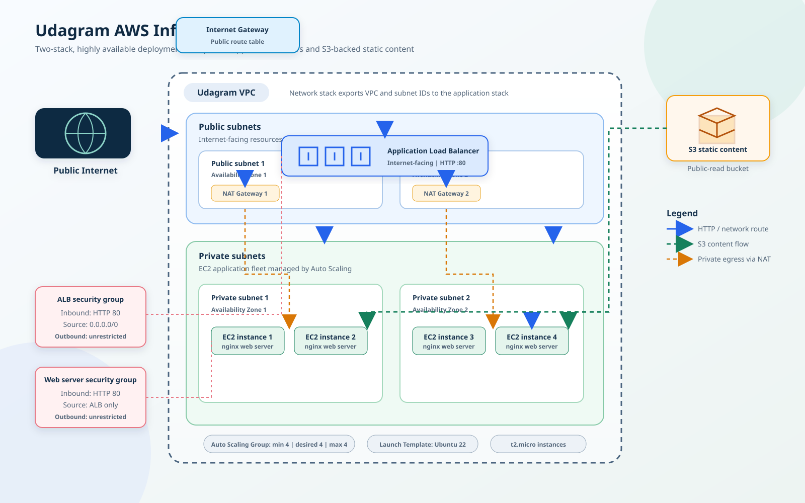

# CD12352 - Infrastructure as Code Project Solution

This project deploys Udagram as two independent AWS CloudFormation stacks:

- `udagram-network` creates the VPC, four subnets, route tables, Internet Gateway, and two NAT Gateways.
- `udagram-app` creates the S3 bucket, IAM role, security groups, Application Load Balancer, launch template, and four private EC2 instances.

The application stack imports the VPC and subnet exports from the network stack. Deploy the network stack first and delete the application stack first.

## Prerequisites

- An AWS account with permissions to create CloudFormation, VPC, EC2, Elastic Load Balancing, Auto Scaling, S3, IAM, and NAT Gateway resources.
- AWS CLI v2 installed and configured with valid credentials.
- Bash available through Git Bash or WSL on Windows.
- A region with at least two Availability Zones. The supplied configuration uses `us-east-1`.
- An Ubuntu 22.04 AMI ID for the deployment region. The supplied value is for `us-east-1`; verify it before deployment.

Configure credentials and the region before running the scripts:

```bash
aws configure
export AWS_REGION=us-east-1
aws sts get-caller-identity
```

On Windows Git Bash, use `export AWS_REGION=us-east-1` in the Git Bash terminal. The scripts also accept `AWS_DEFAULT_REGION`.

## Configuration

Edit [network-parameters.json](network-parameters.json) to change the VPC CIDR, subnet CIDRs, environment name, or Availability Zones.

Edit [udagram-parameters.json](udagram-parameters.json) to provide the correct Ubuntu 22.04 AMI ID for the selected region and the desired instance type. The application currently uses four `t2.micro` instances.

The network export prefix and application environment name must match. The default value is `Udagram`.

## Validate templates

Run the validation script before deployment:

```bash
bash ./scripts/validate.sh
```

The script calls `aws cloudformation validate-template` for both templates. It requires valid AWS credentials because CloudFormation validation is an AWS API operation.

## Spin up or update the infrastructure

```bash
bash ./scripts/create.sh
```

The script:

1. Validates both templates.
2. Creates or updates `udagram-network` using `network.yml` and `network-parameters.json`.
3. Waits for the network stack to complete.
4. Creates or updates `udagram-app` using `udagram.yml` and `udagram-parameters.json`.
5. Waits for the application stack to complete.
6. Prints the application stack outputs, including the ALB URL.

Custom stack names and region can be supplied without editing the scripts:

```bash
AWS_REGION=us-east-1 \
NETWORK_STACK_NAME=udagram-network-test \
APP_STACK_NAME=udagram-app-test \
bash ./scripts/create.sh
```

The application stack imports exports using the `EnvironmentName` value, so changing stack names does not change the required network export prefix.

## Verify the application

Retrieve the URL after deployment:

```bash
aws cloudformation describe-stacks \
	--stack-name udagram-app \
	--query "Stacks[0].Outputs[?OutputKey=='LoadBalancerURL'].OutputValue" \
	--output text \
	--region us-east-1
```

Open the returned URL and verify that it displays:

```text
It works! Udagram, Udacity
```

Check the target health and Auto Scaling Group:

```bash
aws cloudformation describe-stack-resources \
	--stack-name udagram-app \
	--region us-east-1
```

The expected result is four EC2 instances in the two private subnets, registered as healthy targets behind the ALB. The launch script writes the page to S3 and then downloads it from S3 into nginx, satisfying the static-content requirement.

## Tear down the infrastructure

```bash
bash ./scripts/delete.sh
```

The script deletes `udagram-app` first and waits for completion. It then deletes `udagram-network`. This order is required because the application stack consumes exports from the network stack.

Custom stack names can be supplied in the same way as the create script:

```bash
NETWORK_STACK_NAME=udagram-network-test \
APP_STACK_NAME=udagram-app-test \
bash ./scripts/delete.sh
```

NAT Gateways incur AWS charges while they exist. Run teardown after testing and confirm both stacks are deleted.

## Infrastructure diagram



The editable Mermaid source is available in [infrastructure-diagram.md](infrastructure-diagram.md).

## Submission evidence

For a live submission, provide the working ALB URL and verify the required message is visible.

If the resources are deleted before submission, capture:

- CloudFormation outputs from both stacks with visible deployment date and time.
- Successful access to the application through the ALB URL.
- The S3 bucket containing the static file.

Do not commit AWS credentials, private keys, or other secrets to this repository.