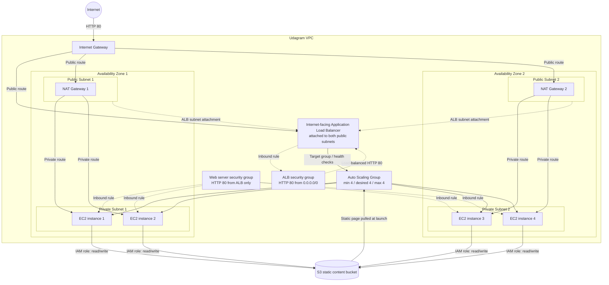

# Udagram Infrastructure Diagram

## Traffic and content flow

- Public HTTP traffic enters through the Internet Gateway and reaches the internet-facing Application Load Balancer.
- The load balancer forwards requests to healthy nginx servers in the private subnets through the Auto Scaling Group.
- Private instances use their Availability Zone's NAT Gateway for outbound software updates and package installation.
- Each instance uses its IAM role to read the static website content from the S3 bucket. The bucket also grants the required read/write permissions to the instance role.
- The two public and two private subnets are distributed across separate Availability Zones for high availability.
